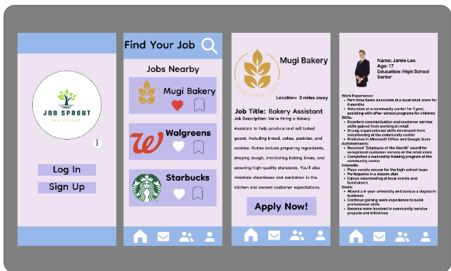
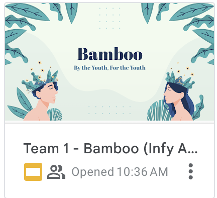
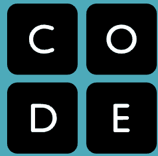
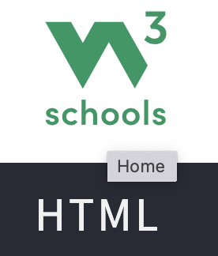

## The challenge

As a group you will create a **WEBPAGE** to host 
1. Navigation bar to individual Member Bio Page (Each member should have their own bio page as we practice in class)
2. Google slide for the presentation .
3. Figma Prototype
4. APP (Optional)
   

You may look a the code of the sample page to guide you group.
 
- [Figma](https://www.figma.com/)
- [Google Slide](https://docs.google.com/presentation) 
- [App Platform](https://studio.code.org/)
- [HTML Help](https://www.w3schools.com/)
- [Last year Pictures](https://www.aurorasamperio.com/Infosys-App-Challange-Recognition/n-Znzmrz)

🔎Look at each line carefully.
🐞Can you fix the bug(s)? 

### Start Here
1. Run and explore the program to identify errors.

  
2. Refer to the **code clips** below to help you fix the errors.

  

   ✅Right click on your code and add a comment explaining what was wrong and how you fixed it. 

  3. You can use Google to find the code you need.

  

🏁 Once you have fixed all errors with comments submit to your teacher.

## Use code clips to help you.

